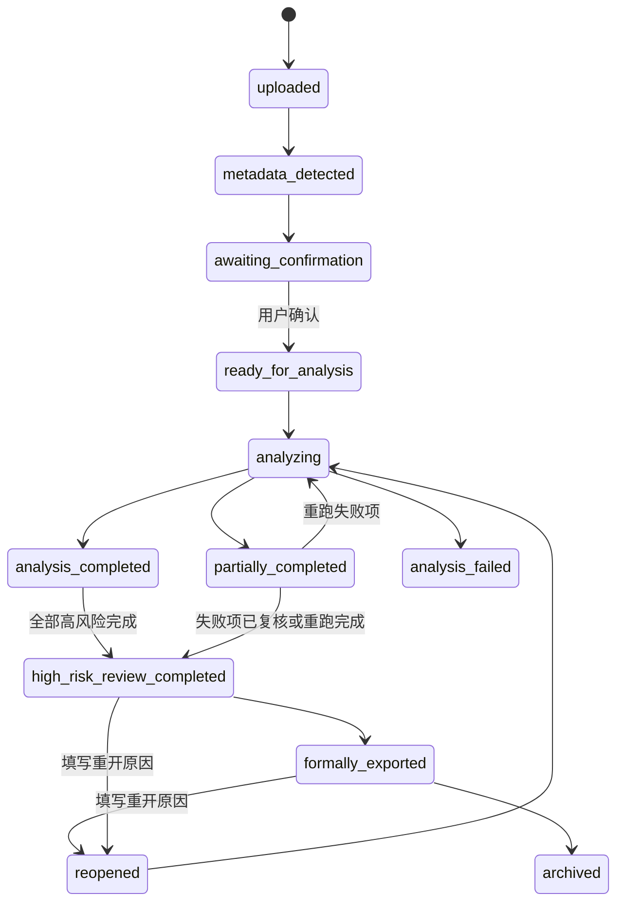

# ESG-Agent 产品与技术设计规格

## 1. 产品结论

ESG-Agent 第一版面向企业 ESG 团队，提供单报告 GRI 核查闭环。系统对每份报告分析全部 577 条 eligible GRI requirement，保留跨企业、跨报告格式的识别泛化能力，并通过高风险队列组织人工复核。

第一版用户流程：

```text
报告列表或上传空状态
→ 上传 PDF
→ 自动识别企业、年度、语言和页数
→ 用户确认报告信息
→ 后台分析 577 条 eligible GRI requirement
→ 展示业务阶段进度和部分失败
→ 高风险队列优先人工复核
→ 按 GRI 主题查看全部结果
→ 形成整改任务
→ 导出完整核查表、管理层摘要和改进任务清单
```

第一版不建设多租户、复杂权限、顾问项目空间、多公司批量分析、同行对标、舆情监测、多标准混合分析或开放式风险规则配置。

## 2. 核心产品原则

1. **分析完整：** 后端固定分析 577 条 eligible GRI requirement。
2. **复核聚焦：** 前端以高风险队列为主，完整核查表为辅。
3. **证据优先：** 每条结论必须能追溯到 PDF 页码和证据片段；无证据或证据质量不足时进入高风险。
4. **系统与人工分离：** 系统 assessment 保持不可变，人工操作形成只追加 review snapshot。
5. **范围诚实：** “高风险复核已完成”不表示全部 577 条已人工确认。
6. **部分失败可用：** 单个 requirement 失败不丢弃其他结果；失败项进入高风险并支持重跑。
7. **业务语言：** 普通界面显示中文业务名称，不暴露 profile、ontology、route、evidence kind 等内部实现。
8. **输出可审计：** 草稿和正式版本区分，明确人工确认范围与系统待确认范围。

## 3. 已确认技术选型

| 类别 | 选型 |
| --- | --- |
| 仓库 | Monorepo：`backend`、`frontend`、`docs` |
| 后端 | Python 3.11、FastAPI、Pydantic v2 |
| 数据库 | PostgreSQL、SQLAlchemy 2.0、Alembic，预留 pgvector |
| 前端 | Next.js App Router、TypeScript |
| UI | Tailwind CSS、shadcn/ui、lucide icons |
| 数据请求 | TanStack Query |
| 表格 | TanStack Table |
| 图表 | Recharts，通过业务组件封装 |
| PDF | pypdf、pdfplumber、OCRmyPDF/Tesseract、Docling fallback、授权后 VLM 辅助 |
| 模型 | OpenAI-compatible 薄适配层，默认不调用 |
| 测试 | pytest、Vitest、React Testing Library、typecheck、build |
| 包管理 | 后端 uv，前端 pnpm |

保持当前 Next.js/FastAPI 技术栈。`esg-dashboard` 只作为信息架构、颜色语言和组件风格参考，不迁移其 Vite/React 技术栈。

## 4. 页面信息架构

### 4.1 路由

```text
/reports                         报告列表与上传入口
/reports/[reportId]/confirm      报告信息确认
/reports/[reportId]/progress     分析阶段进度
/reports/[reportId]/dashboard    报告仪表盘
/reports/[reportId]/review       三栏人工复核工作台
/reports/[reportId]/assessments  完整 GRI 核查表
/reports/[reportId]/actions      整改任务清单
/reports/[reportId]/exports      输出与版本记录
/reports/[reportId]/audit        报告审计记录
```

报告列表是产品入口。首次使用显示上传空状态；已有报告时显示报告列表。用户可设置本地偏好，在进入产品时自动打开上次报告。

### 4.2 上传与确认

上传后系统预检测：

- 企业名称；
- 报告年度；
- 主要语言；
- PDF 页数；
- 文件名和 SHA256；
- 文本可用性与扫描风险。

metadata 预检测优先使用文件名和 PDF 前两页可提取文本，识别企业名称、报告年度、主要语言和页数。检测值只作为确认页候选值，用户确认前不写入正式业务字段。无法从本地文本可靠识别时保持空值，不调用外部模型、OCR 或 VLM，不补造企业信息。

用户确认企业、年度和语言后才能启动分析。自动识别值必须允许修改，修改写入审计事件。

### 4.3 报告仪表盘

仪表盘显示：

- 分析状态和最新正式输出版本；
- 577 条结果分布；
- 高、中、低风险数量；
- 高风险复核进度；
- GRI 主题分布；
- 部分失败与需要重跑的 requirement；
- 待整改任务摘要。

不得展示无来源的准确率或暗示系统结论已经全部人工确认。

### 4.4 三栏复核工作台

桌面端：

- 左栏：风险队列、风险原因、GRI 主题、复核状态和搜索；
- 中栏：requirement 中文名称、系统结果、人工结果、判断依据、缺失项、备注和操作；
- 右栏：PDF 页面、证据片段、页码导航和证据有效性操作。

窄屏端切换 `风险队列 / 核查详情 / PDF 证据` 三个视图。切换不丢失当前 requirement、未保存编辑内容或 PDF 页码。

### 4.5 完整核查表

完整核查表承载 577 条结果，必须分页并支持：

- GRI 主题；
- 风险等级；
- 系统结论；
- 人工结论；
- 复核状态；
- 证据状态；
- 整改状态；
- 关键词。

## 5. 业务字段与内部字段

普通界面使用中文业务字段：

| 中文业务名称 | 内部字段 |
| --- | --- |
| 系统结论 | `verdict` |
| 人工结论 | `reviewed_verdict` |
| 复核状态 | `review_status` |
| 风险等级 | `risk_level` |
| 风险原因 | `risk_reason_codes` |
| 判断依据 | `rationale` |
| 缺失项 | `missing_items` |
| PDF 页码 | `source_pdf_page` |
| 报告页码 | `source_report_page` |
| 证据片段 | `evidence_preview` |

高级说明可以显示“中文（字段名）”。profile、ontology、route、candidate pages、evidence kind 和内部 guardrail 只进入诊断日志或管理员级导出，不进入普通产品界面。

## 6. 状态模型

### 6.1 报告状态



### 6.2 分析阶段

业务阶段固定为：文件检查、PDF 解析、报告结构识别、GRI requirement 匹配、证据与结论生成、风险分级、结果汇总。

阶段状态：`pending / running / completed / partially_failed / failed`。每阶段保存完成数量、总数量、开始时间、结束时间和业务错误摘要。

普通进度页按阶段工作量加权：文件检查 5%、PDF 解析 10%、报告结构识别 5%、GRI requirement 匹配 10%、证据与结论生成 60%、风险分级 5%、结果汇总 5%。阶段内按 `completed_units / total_units` 计算，成功终态强制为 100%，失败终态保留最后真实百分比；不使用定时伪增长或随机增量。running run 的最新有效 stage event 超过 120 秒未更新时，前端提示后台任务可能中断，但不修改数据库状态。上传和 metadata 确认阶段不展示 577 条计数；577 条 eligible requirement 继续作为后端完整性和回归门禁，不作为首次上传时的前端识别结果。

### 6.3 Requirement 复核状态

```text
pending_review
reviewed_approved
reviewed_modified
evidence_invalidated
reopened
```

快速通过生成 `reviewed_approved`；修改任何字段生成 `reviewed_modified`；证据无效生成 `evidence_invalidated` 并重新计算风险。

### 6.4 输出状态

```text
draft
formal
superseded
voided
```

旧正式版本不得覆盖。报告重开并生成新正式版本后，旧版本转为 `superseded`。

## 7. 固定风险模型

风险等级独立于 verdict 和 review status，采用 `high / medium / low`。每条结果保存 `risk_level`、`risk_reason_codes` 和 `risk_rule_version`。

### 7.1 高风险

任一条件成立：

- requirement 分析失败或没有 assessment；
- `verdict=unknown`；
- 无有效 source evidence；
- 需要 OCR/VLM，或存在正文未抽取、证据错页、页码冲突；
- omission note、index statement 或非 substantive evidence 是唯一依据；
- 结论与证据充分性冲突；
- 人工标记证据无效；
- 批量操作后需要抽查；
- 正式输出后重新开启。

### 7.2 中风险

- `verdict=partially_disclosed` 且有有效 substantive evidence；
- 缺拆分维度、方法、假设或边界；
- 有明确整改项但核心证据有效。

### 7.3 低风险

- `verdict=disclosed`；
- 有直接、可定位且质量合格的 substantive evidence；
- 没有解析失败、质量风险或充分性冲突。

高风险完成率的分母取当前报告最新有效 run 的高风险 requirement 集合。重开或风险重算后分母允许变化，变化必须写入审计事件。

## 8. 人工复核与审计

### 8.1 单用户身份

第一版不建设账号系统。用户首次执行复核时填写复核人名称，前端本地保存便于后续默认填充，服务端每次写操作仍显式接收并保存复核人。

### 8.2 可编辑内容

- 结论；
- 证据页；
- 证据片段；
- 判断依据；
- 缺失项；
- 备注。

系统 assessment 不可覆盖。每次人工操作追加 review snapshot 和字段级 change event，保存原值、新值、复核人、时间、原因、操作类型和上一个 snapshot。

### 8.3 操作规则

- 快速通过：允许预设原因，备注可选；
- 修改：备注必填；
- 无效证据：备注必填；
- 批量操作：备注必填；
- 重开 requirement 或报告：原因必填。

审计记录只追加，不允许更新和删除。

## 9. 部分失败与重跑

分析失败分为：文件、解析、结构识别、route、evidence、assessment 和系统异常。

- 已成功 requirement 的 assessment 保留；
- 失败 requirement 自动进入高风险；
- 报告状态为 `partially_completed`；
- 用户可只重跑失败项；
- 新 run 与旧 run 分开保存；
- 重跑成功后通过最新有效结果视图合并展示，历史结果仍可审计。

后台分析任务只接收 `report_id/run_id`，在工作线程内创建并关闭独立数据库 session，禁止继续使用请求 session。工作流异常时先 rollback，再追加失败阶段、审计和 run/report 失败状态；服务启动时把遗留 `pending/running` run 收敛为 `failed`，失败原因固定为“分析服务重启，任务已中断”。

同一报告重新解析时，`document_pages` 和 `document_chunks` 在单一事务中按 report 先删后写；失败必须 rollback，避免唯一键冲突或页、分块半更新。

## 10. 后端模块边界

```text
backend/src/
  domain/       状态、DTO 和业务规则
  db/           持久化模型、repository、migration
  standards/    GRI requirement、ontology 和充分性规则
  agents/       系统 assessment
  workflows/    报告分析与失败项重跑
  services/     PDF、风险、复核、整改、导出、审计
  api/          报告、运行、结果、复核、整改和输出接口
```

report profile 只提供当前报告的候选证据路由。通用逻辑依赖行标签、章节语义、年份、单位和证据类型，不依赖固定页码。

## 11. 数据库设计方向

现有 `reports`、`analysis_runs`、`document_pages`、`document_chunks`、`standard_requirements`、`disclosure_tasks`、`assessments`、`evidence_items`、`recommendations`、`review_decisions` 和 `audit_events` 保留。

设计新增：

- `analysis_stage_events`：业务阶段进度；
- `assessment_risks`：风险等级、原因和规则版本；
- `review_snapshots`：人工结果快照；
- `review_change_events`：字段级变更；
- `improvement_actions`：整改任务；
- `export_versions`：草稿和正式输出版本。

`reports` 扩展企业、年度、语言、metadata confirmation 和报告状态；`analysis_runs` 扩展引擎版本、风险规则版本和部分失败统计。具体字段和迁移顺序以 `docs/product/data-model-impact.md` 为准。

`0009_active_analysis_run_gate` 在 `analysis_runs(report_id)` 上增加只覆盖 `pending/running` 的 PostgreSQL 部分唯一索引，数据库负责保证同一报告最多一个 active run；历史终态 run 不受限制。

替代接口或新表实际启用后，旧接口和旧表进入两个连续阶段验收周期的兼容窗口。每个周期必须有自动回归覆盖；连续两轮通过且历史数据映射一致后，才允许在后续独立迁移中清理。审批日期和仅完成代码定义不计入兼容周期。

## 12. API 边界

API 前缀保持 `/api`。资源分组：

- reports：列表、上传、详情、metadata 确认、分析、重开；
- runs：状态、阶段、失败项重跑；
- assessments：分页列表、详情和筛选；
- review：风险队列、决策、批量操作、历史和重开；
- actions：整改任务；
- exports：草稿、正式版本和文件；
- audit：报告级只追加记录。
- demo：仅 demo 环境可用的在线业务数据清理。

报告 metadata 只允许在 `uploaded/metadata_detected/awaiting_confirmation/ready_for_analysis` 写入；进入分析后返回 `409 report_metadata_locked`。分析启动先查询 active run，并由数据库唯一索引处理竞态；冲突返回 `409 analysis_already_running`。

详细请求、响应和错误码以 `docs/product/api-contract.md` 为准。OpenAPI 是前端类型唯一来源。

## 13. PDF 与外部模型边界

PDF 继续采用分级路由：pypdf/pdfplumber 为默认主链路；扫描关键页可显式启用 OCR；复杂失败页允许 Docling fallback；VLM 只有用户显式确认后才允许调用。

硬性原则：

- 原始 PDF 不覆盖；
- OCR 产物作为派生文件保存；
- 外部模型默认不调用；
- VLM 输出不直接成为最终合规事实；
- OCR/VLM、低文本和复杂表格风险进入 evidence quality 和风险模型；
- 测试中 mock 外部模型。

## 14. 输出设计

第一版支持：

1. 完整 GRI 核查表：Excel、可打印网页；
2. 管理层摘要：PDF、可打印网页；
3. 改进任务清单：Excel；
4. 审计说明：复核范围、系统待确认范围、版本和生成时间。

草稿输出带草稿标识。正式输出只有在高风险复核完成后生成，并绑定：原文件哈希、run、GRI requirement 版本、分析引擎版本、风险规则版本和 review snapshot 版本。

输出必须区分人工确认结果与系统待确认结果，并注明仍未人工复核的中低风险数量。

## 15. 前端设计约束

- 工作台式界面，不做聊天入口；
- 报告和核查对象是首屏信号；
- 使用紧凑信息密度，不使用营销式 hero；
- 按钮使用 lucide icons 和明确 tooltip；
- 页面不直接依赖 Recharts API；
- 577 条表格分页和按需加载证据；
- 所有核心指标来自后端 API；
- 空、加载、部分失败、失败和无权限外的单用户状态均有明确呈现；
- 中文业务名称优先，内部字段仅在高级说明出现。

## 16. 测试与验收

后端重点：

- 577 条任务生成；
- 报告 metadata 确认；
- 阶段进度和部分失败；
- 风险规则和版本；
- review snapshot 只追加；
- 必填原因校验；
- 高风险完成门槛；
- 正式输出版本和复核范围；
- OpenAPI 契约与数据库迁移。

前端重点：

- 报告列表和上传空状态；
- metadata 确认；
- 分析阶段进度；
- 风险队列筛选；
- 三栏与窄屏视图；
- 快速通过和字段编辑；
- 批量操作备注；
- 完整核查表分页；
- 草稿/正式输出门槛。

验收命令：

```powershell
cd backend
uv run pytest

cd ../frontend
pnpm typecheck
pnpm test
pnpm build
```

## 17. 实施顺序

1. 报告列表、metadata 检测与确认；
2. 577 条后台分析、阶段进度和部分失败；
3. 固定风险模型与风险队列 API；
4. review snapshot、字段级审计和重开；
5. 报告仪表盘与三栏复核工作台；
6. 完整核查表与整改任务；
7. 草稿和版本化正式输出；
8. 使用不同企业报告验证产品闭环和分析泛化。

## 18. 当前实现与验收状态

截至 2026-07-15，代码迁移 head 为 `0009_active_analysis_run_gate`。报告上传与 metadata 确认、577 条分析、工作量加权阶段进度、active run 门禁、后台任务恢复、固定风险队列、追加式复核、三栏工作台、整改任务、版本化输出和 demo 在线重置均已有实现。Envision regeneration gate 为 577 个唯一 eligible requirement、audit `ok=true`、verdict delta=0；Goldwind 100 条人工 gold gate 未出现 false disclosed 或 wrong source page。

当前停止点为人工产品验收。设计中仍有部分增强项未进入 MVP 实现，包括批量复核 API、独立 reopen API、按 report 查询的审计 API、单个 export metadata/文件下载 API，以及完整整改任务清单导出。实际接口状态以 OpenAPI 和 `docs/product/api-contract.md` 的状态标记为准。

旧 `review_decisions` 已完成两个连续兼容周期的数据映射验证，但旧 API、旧前端页面和旧导出仍有调用者，因此继续保留。验收风险、运行命令和下一步见 `docs/DEVELOPMENT.md`。

## 19. 本地演示环境隔离

项目最终只在本机部署验证，使用一套代码、Alembic migration、GRI 规则、report profile 和只读原始资产。业务数据按用途分为三个 PostgreSQL 数据库：

- `esg_agent`：开发、回归、正式验收和长期保留，禁止自动重置；
- `esg_agent_demo`：产品演示，每次演示前允许显式重建为空库；
- `esg_agent_test`：自动测试，测试过程允许清理。

演示环境使用 `APP_ENV=demo`，上传和派生文件只能写入 `backend/data/runtime/demo/`。现有 `esg_agent` 继续使用原运行时目录，不迁移已有文件或数据库路径引用。`backend/data/reports/`、`backend/data/standards/` 和 `backend/data/manifests/` 为共享只读资产，不随演示库重置。

重复上传仍以文件哈希返回 `409 duplicate_report`，响应同时给出已有报告状态和 `can_start_new_demo`。前端允许直接查看已有结果；仅在后端确认当前连接为安全 demo 环境时显示“开始新演示”，二次确认后调用 `POST /api/demo/reset` 并自动重新上传原文件。

在线重置必须校验 `APP_ENV=demo`、配置数据库名、`SELECT current_database()` 的实际库名、上传/派生目录边界、精确确认口令和不存在 active run。数据库先在一个事务内追加重置审计并删除 report 根业务数据，再清理 `uploads/derived`；运行时目录包含 reparse point 时拒绝清理。数据库已清空而文件清理失败时返回结构化部分失败，禁止伪装成全部成功。

后端启动不会自动清空 demo；离线 `reset_demo_environment` 继续作为服务停止后的故障恢复路径。外部模型、OCR 和 VLM 继续默认关闭。
