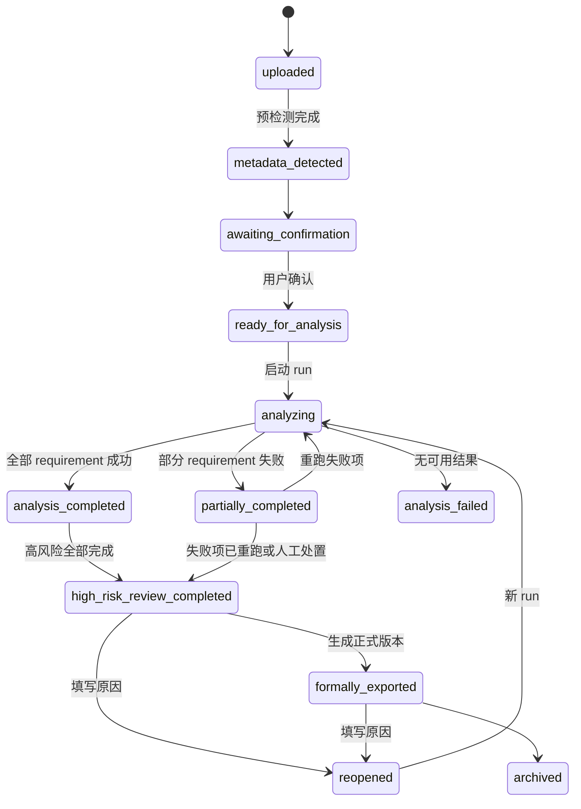
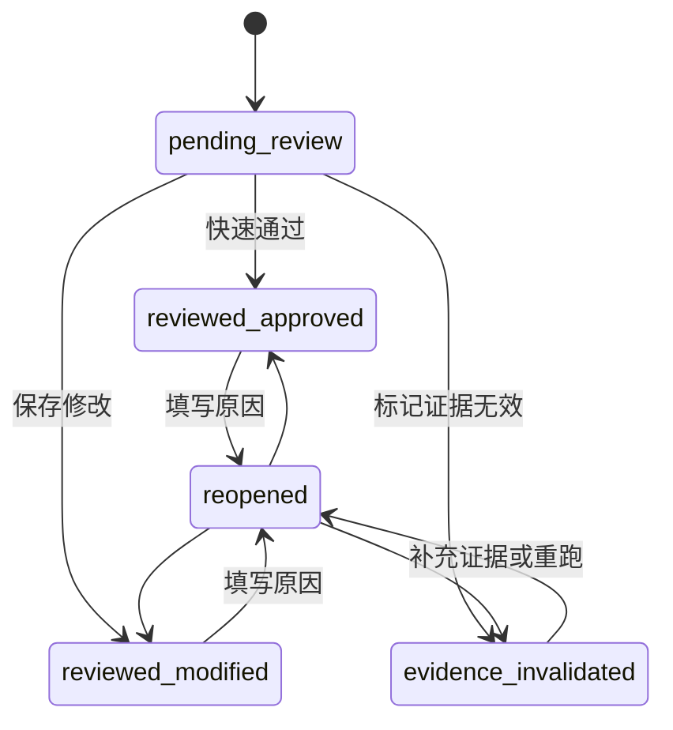
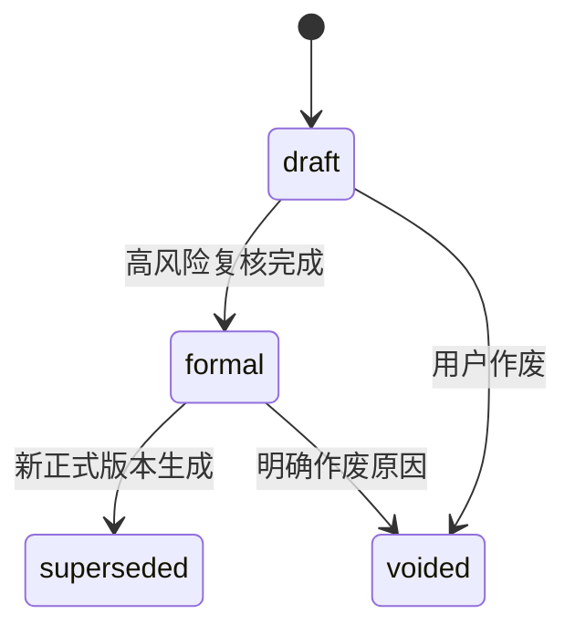

# 产品状态模型

## 1. 报告状态



| 转换 | 触发条件 | 审计事件 | 失败行为 |
| --- | --- | --- | --- |
| uploaded → metadata_detected | 文件检查和 metadata 检测完成 | `report_metadata_detected` | 保持 uploaded，记录检测错误 |
| awaiting_confirmation → ready_for_analysis | 企业、年度、语言确认 | `report_metadata_confirmed` | 返回字段错误 |
| ready_for_analysis → analyzing | 创建 run 成功 | `analysis_started` | 保持 ready_for_analysis |
| analyzing → partially_completed | 至少一条成功且至少一条失败 | `analysis_partially_completed` | 失败项进入高风险 |
| analysis_completed → high_risk_review_completed | 当前风险分母全部完成 | `high_risk_review_completed` | 状态不变 |
| formally_exported → reopened | 原因非空 | `report_reopened` | 拒绝请求 |

## 2. Run 状态与阶段状态

Run 状态：`pending / running / partially_completed / completed / failed`。

阶段固定顺序：

```text
file_validation
pdf_parsing
report_structure_detection
gri_requirement_matching
evidence_assessment
risk_classification
result_aggregation
```

阶段状态：`pending / running / completed / partially_failed / failed`。

每个阶段事件包含：`stage_code`、`status`、`completed_units`、`total_units`、`started_at`、`completed_at`、`error_summary`。

## 3. Requirement 结果状态

系统 assessment 由 run 生成，创建后不可覆盖。人工状态：



每次转换生成新 review snapshot。`reopened` 不删除此前 snapshot。

## 4. 整改任务状态

```text
open → in_progress → completed
open → cancelled
in_progress → cancelled
completed → reopened → in_progress
```

完成和重开需要说明。整改状态不自动改变 requirement 的人工结论。

## 5. 输出状态



正式输出不可覆盖文件。`voided` 和 `superseded` 版本仍可查看审计元数据。

## 6. 高风险完成率

```text
完成率 = 已有有效人工 snapshot 的高风险 requirement 数 / 当前高风险 requirement 总数
```

分母绑定报告最新有效 run 和 `risk_rule_version`。重跑、证据无效或报告重开导致分母变化时，记录旧分母、新分母和原因。

页面只能显示“高风险复核已完成”或“高风险复核 X/Y”，不得显示“577 条全部已确认”，除非确实存在 577 条有效人工 snapshot。
