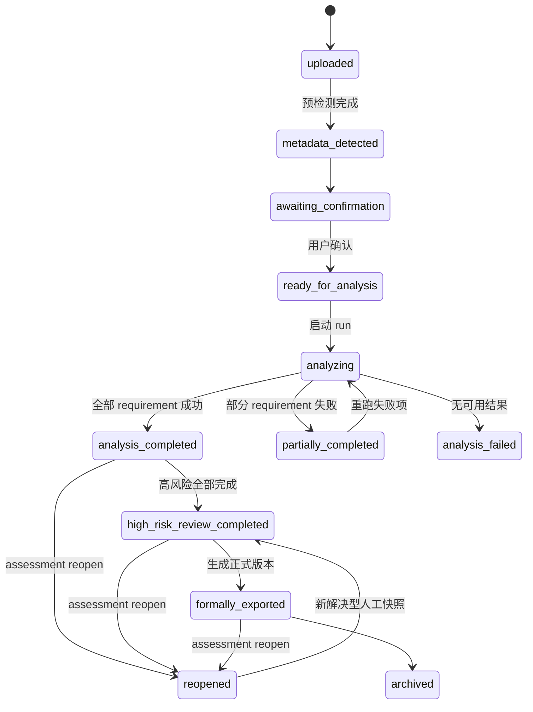
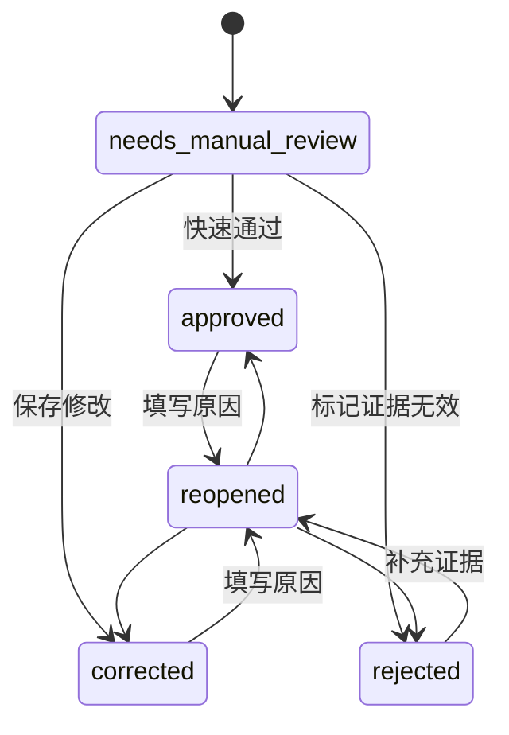
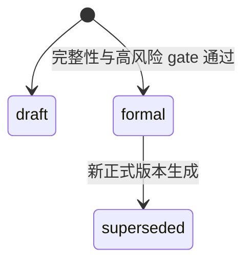

# 产品状态模型

## 1. 报告状态


```mermaid
stateDiagram-v2
    [*] --> uploaded
    uploaded --> metadata_detected: 预检测完成
    metadata_detected --> awaiting_confirmation
    awaiting_confirmation --> ready_for_analysis: 用户确认
    ready_for_analysis --> analyzing: 启动 run
    analyzing --> analysis_completed: 全部 requirement 成功
    analyzing --> partially_completed: 部分 requirement 失败
    analyzing --> analysis_failed: 无可用结果
    partially_completed --> analyzing: 重跑失败项
    analysis_completed --> high_risk_review_completed: 高风险全部完成
    high_risk_review_completed --> formally_exported: 生成正式版本
    analysis_completed --> reopened: assessment reopen
    high_risk_review_completed --> reopened: assessment reopen
    formally_exported --> reopened: assessment reopen
    reopened --> high_risk_review_completed: 新解决型人工快照
    formally_exported --> archived
```

| 转换 | 触发条件 | 审计事件 | 失败行为 |
| --- | --- | --- | --- |
| uploaded → metadata_detected | 文件检查和 metadata 检测完成 | `report_metadata_detected` | 保持 uploaded，记录检测错误 |
| awaiting_confirmation → ready_for_analysis | 企业、年度、语言确认 | `report_metadata_confirmed` | 返回字段错误 |
| ready_for_analysis → analyzing | 创建 run 成功 | `analysis_started` | 保持 ready_for_analysis |
| analyzing → partially_completed | 至少一条成功且至少一条失败 | `analysis_completed`，run 状态为 partially completed | 失败项进入有效范围中的 `failed` 状态 |
| analysis_completed → high_risk_review_completed | 当前风险分母全部完成 | `high_risk_review_completed` | 状态不变 |
| analysis_completed / high_risk_review_completed / formally_exported → reopened | assessment 新增 `operation_type=reopen` 快照 | `review_snapshot_created` | 快照写入失败则报告状态不变 |
| reopened → high_risk_review_completed | 重新满足高优先级复核 gate | `review_snapshot_created` | 保持 reopened |

当前没有独立 report reopen API。报告 `reopened` 由 assessment 的追加式人工快照驱动，不启动新分析 run，也不删除旧 snapshot、run 或输出。

## 2. Run 状态与阶段状态

Run 状态：`pending / running / partially_completed / completed / failed`。

阶段固定顺序：

```text
file_validation
pdf_parsing
report_structure
requirement_matching
evidence_assessment
risk_classification
ai_assistance
result_summary
```

阶段状态：`pending / running / completed / skipped / partially_failed / failed`。

每个阶段事件包含：`stage_code`、`status`、`completed_units`、`total_units`、`started_at`、`completed_at`、`error_summary`。

## 3. Requirement 结果状态

系统 assessment 由 run 生成，创建后不可覆盖。人工状态：


```mermaid
stateDiagram-v2
    [*] --> needs_manual_review
    needs_manual_review --> approved: 快速通过
    needs_manual_review --> corrected: 保存修改
    needs_manual_review --> rejected: 标记证据无效
    approved --> reopened: 填写原因
    corrected --> reopened: 填写原因
    rejected --> reopened: 补充证据
    reopened --> approved
    reopened --> corrected
    reopened --> rejected
```

每次操作生成新 review snapshot。`reopened` 是快照操作语义；数据库 review status 继续使用 `needs_manual_review / approved / corrected / rejected`，此前 snapshot 保持不可变。

## 4. 整改任务状态

```text
open → in_progress → completed
open → cancelled
in_progress → cancelled
completed → in_progress
cancelled → open
```

完成、取消和重新打开需要说明。整改状态不自动改变 requirement 的人工结论。

## 5. 输出状态


```mermaid
stateDiagram-v2
    [*] --> draft
    [*] --> formal: 完整性与高风险 gate 通过
    formal --> superseded: 新正式版本生成
```

草稿版本号固定为 0，正式版本按报告递增。正式输出不可覆盖文件；生成新正式版本时，上一正式版本进入 `superseded`，历史文件继续可下载。

当前未实现 `voided` 操作。

## 6. 高风险完成率

```text
完成率 = 已有有效人工 snapshot 的高风险 requirement 数 / 当前高风险 requirement 总数
```

分母绑定报告最新有效运行谱系和 `risk_rule_version`。重跑、证据无效或 assessment reopen 导致分母变化时，记录旧分母、新分母和原因。

页面只能显示“高风险复核已完成”或“高风险复核 X/Y”，不得显示“577 条全部已确认”，除非确实存在 577 条有效人工 snapshot。
